[](https://Un2050-v1-3-e08d6b94e893.herokuapp.com/)

 

---
[](https://loqta2050-v1-3-e08d6b94e893.herokuapp.com/)


[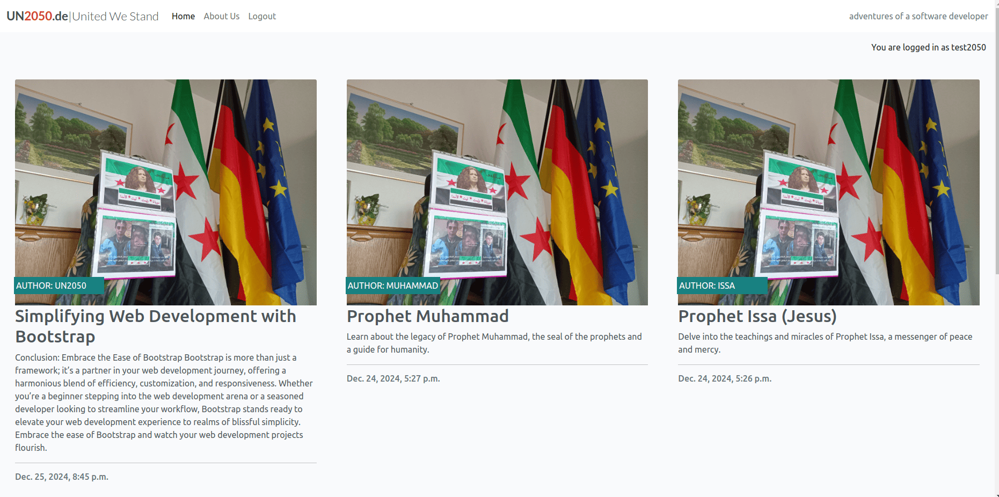](https://loqta2050-v1-3-e08d6b94e893.herokuapp.com/)


[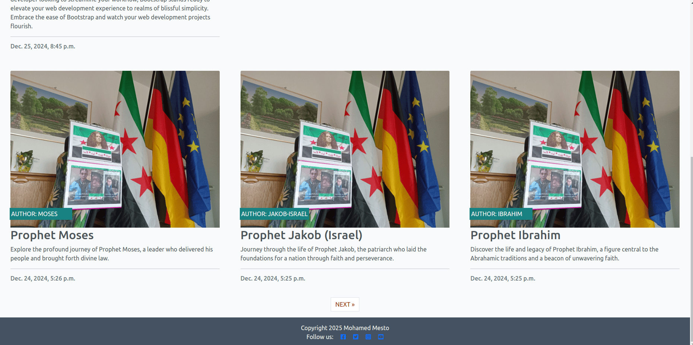](https://loqta2050-v1-3-e08d6b94e893.herokuapp.com/)
---
# **_Un2050.de News Site V1.3_**

## UN2050 News Site V1.3 (Stay Informed, Stay Empowered) - Portfolio Project 4 - Full Stack Toolkit project.

**UN2050 News Site V1.3:** A Gateway to Global News and Insightful Commentary  

The **UN2050 News Site** is designed to keep users informed and engaged with the latest happenings around the world. Powered by Django, this dynamic platform delivers a seamless experience for accessing news across diverse categories, reflecting a commitment to accuracy, reliability, and user engagement.

### A Platform for Knowledge and Connection  

At its core, **UN2050 News Site V1.3** offers users a curated selection of articles covering a wide array of topics, from politics and technology to environment and lifestyle. The intuitive navigation and categorization make it easy for readers to discover content tailored to their interests. Each article includes engaging headlines, detailed descriptions, and author insights, creating a sense of connection between the writers and the audience.

### A User-Centric Experience  

The platform is designed with usability in mind, featuring:  
- **Dynamic Categorization:** Quickly locate articles in trending topics or specific categories.  
- **Interactive Features:** Registered users can log in to comment, like, and share articles, fostering a sense of community among readers.  
- **Mobile Responsiveness:** The site ensures accessibility across devices, making it convenient for users on the go.  

### A Tool for Critical Thinking and Awareness  

By presenting diverse perspectives on current events, **UN2050 News Site** empowers users to think critically about the world around them. Whether delving into investigative reports or exploring lifestyle tips, readers are encouraged to engage with the content actively, broadening their understanding and fostering a global perspective.

### Continuous Innovation and Growth  

The **UN2050 News Site V1.3** reflects the iterative evolution of a robust platform. Features such as the comments section, user-friendly contact forms, and seamless social sharing are just the beginning of a roadmap aimed at enhancing the user experience. Each iteration is a step closer to making this site a go-to destination for news enthusiasts worldwide.

### Conclusion  

In an era of rapid information exchange, **UN2050 News Site V1.3** stands out as a reliable and engaging news source. It goes beyond simply reporting; it fosters awareness, inspires dialogue, and creates connections among its audience. The live site invites you to explore this vibrant news hub and be part of a growing community of informed individuals.

**You can view the live site here - [UN2050 News Site V1.3](https://loqta2050-v1-3-e08d6b94e893.herokuapp.com/).**  


[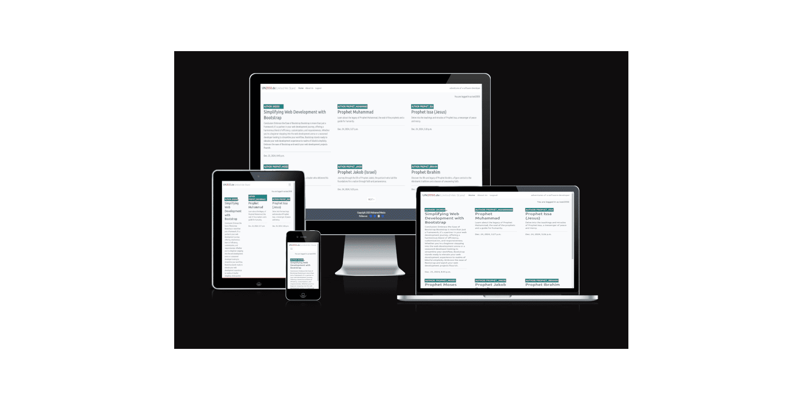](https://loqta2050-v1-3-e08d6b94e893.herokuapp.com/)


# Contents

- [**_Un2050.de News Site V1.3_**](#un2050de-news-site-v13)
  - [UN2050 News Site V1.3 (Stay Informed, Stay Empowered) - Portfolio Project 4 - Full Stack Toolkit project.](#un2050-news-site-v13-stay-informed-stay-empowered---portfolio-project-4---full-stack-toolkit-project)
    - [A Platform for Knowledge and Connection](#a-platform-for-knowledge-and-connection)
    - [A User-Centric Experience](#a-user-centric-experience)
    - [A Tool for Critical Thinking and Awareness](#a-tool-for-critical-thinking-and-awareness)
    - [Continuous Innovation and Growth](#continuous-innovation-and-growth)
    - [Conclusion](#conclusion)
- [Contents](#contents)
  - [Purpose of the project](#purpose-of-the-project)
  - [User Stories:](#user-stories)
  - [**User Stories**](#user-stories-1)
    - [**As a Site User**:](#as-a-site-user)
    - [**As a Site Admin**:](#as-a-site-admin)
    - [**As a Site Owner**:](#as-a-site-owner)
  - [Site Structure](#site-structure)
  - [Design Choices](#design-choices)
    - [Colour Scheme](#colour-scheme)
    - [Typography](#typography)
  - [Features:](#features)
    - [Existing Features:](#existing-features)
    - [Future Features:](#future-features)
  - [Technologies Used](#technologies-used)
  - [Data Model:](#data-model)
  - [Testing:](#testing)
  - [Chrome Test](#chrome-test)
  - [Lighthouse Testing](#lighthouse-testing)
  - [Performance](#performance)
    - [Desktop lighthouse Performance](#desktop-lighthouse-performance)
    - [Mobile lighthouse Performance](#mobile-lighthouse-performance)
  - [Accessibility Testing](#accessibility-testing)
      - [Lighthouse Accessibility Testing](#lighthouse-accessibility-testing)
      - [WAVE Web Accessibility Evaluation Tool](#wave-web-accessibility-evaluation-tool)
    - [Fixing Accessibility issues:](#fixing-accessibility-issues)
      - [Adobe Color Accessibility Tool](#adobe-color-accessibility-tool)
  - [Responsive Testing](#responsive-testing)
      - [The Responsive Design Checker](#the-responsive-design-checker)
      - [The Viewport Resizer](#the-viewport-resizer)
    - [Manual Testing:](#manual-testing)
    - [Automated Unit Testing:](#automated-unit-testing)
    - [Running Tests:](#running-tests)
  - [Validator Testing - Bugs Fixed:](#validator-testing---bugs-fixed)
  - [HTML Validation](#html-validation)
    - [**Example 1: Invalid Attribute in an Element**](#example-1-invalid-attribute-in-an-element)
      - [**Error**:](#error)
      - [**Cause**:](#cause)
      - [**Fix**:](#fix)
      - [**Code Example**:](#code-example)
      - [**JavaScript Access**:](#javascript-access)
    - [**Example 2: Invalid Width Attribute Value**](#example-2-invalid-width-attribute-value)
      - [**Error**:](#error-1)
      - [**Cause**:](#cause-1)
      - [**Fix**:](#fix-1)
      - [**Code Example**:](#code-example-1)
    - [**Key Takeaways**:](#key-takeaways)
  - [CSS Validation](#css-validation)
  - [JS Validation](#js-validation)
    - [Fixes Applied](#fixes-applied)
  - [Py Validation](#py-validation)
  - [Getting Started:](#getting-started)
  - [Deployment:](#deployment)
  - [Credits](#credits)


 


## Purpose of the project 

The goal of **Un2050** is to create a modern, Reddit-style news platform where users can share and discuss stories from around the world. By leveraging Django and PostgreSQL, this project aims to foster a community of contributors and readers, with features designed to enhance interaction, such as upvoting, commenting, and categorizing content by topics.

Whether you're a casual reader, an active participant, or a site admin, **Un2050** provides tools to create, manage, and engage with content in a meaningful way.


## User Stories:

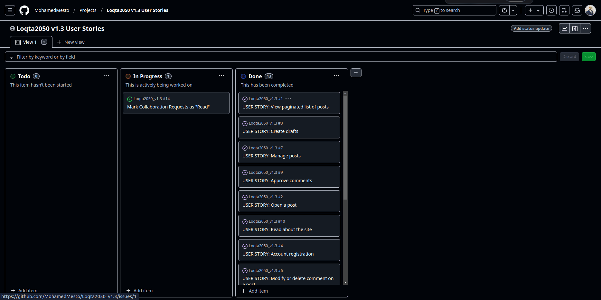


## **User Stories**

### **As a Site User**:  

1. **View News Stories and Comments**  
   - *I want to view news stories and comments on different topics so I can stay informed and engaged.*  
   - **Acceptance Criteria**:  
     - AC1: A user can see a list of posts.  
     - AC2: A user can view all comments on a specific post by clicking on the comment thread.

2. **Register and Log In**  
   - *I want to register and log in to the platform so I can contribute by posting news stories and leaving comments.*  
   - **Acceptance Criteria**:  
     - AC1: A user can register an account using their email.  
     - AC2: A registered user can log in.  
     - AC3: Logged-in users can comment on posts.  

3. **Upvote or Downvote Posts**  
   - *I want to upvote or downvote posts so I can show my opinion on the content.*

4. **Filter Posts by Categories**  
   - *I want to filter posts by categories so I can quickly find stories that interest me.*

5. **View Time and Date of Posts**  
   - *I want to view the time and date of each post so I can know when the story was published.*

6. **View Comments on a Post**  
   - *I can view comments on an individual post so that I can read the conversation.*  
   - **Acceptance Criteria**:  
     - AC1: Admins can view one or more comments.  
     - AC2: Users can click on a comment thread to read the conversation.

7. **Leave Comments on a Post**  
   - *I can leave comments on a post so that I can be involved in the conversation.*  
   - **Acceptance Criteria**:  
     - AC1: Approved comments are visible.  
     - AC2: Users can reply to comments, forming conversation threads.  
     - AC3: Conversations are threaded when multiple comments exist.

8. **Modify or Delete My Comments**  
   - *I can modify or delete my comment on a post so that I can stay involved in the conversation.*  
   - **Acceptance Criteria**:  
     - AC1: Logged-in users can edit their comments.  
     - AC2: Logged-in users can delete their comments.

9. **View Full Post**  
   - *I can click on a post so that I can read the full text.*  
   - **Acceptance Criteria**:  
     - AC1: Clicking on a post title opens a detailed view of the post.

10. **Paginated List of Posts**  
    - *I can view a paginated list of posts so that I can select which post I want to view.*  
    - **Acceptance Criteria**:  
      - AC1: Multiple posts are listed when available in the database.  
      - AC2: The main page displays a paginated list of post titles.

11. **Read About the Site**  
    - *I can click on the About link so that I can read about the site.*  
    - **Acceptance Criteria**:  
      - AC1: Clicking the About link displays the site’s information.

---

### **As a Site Admin**:  

1. **Moderate User Posts and Comments**  
   - *I want to manage user posts and comments so I can moderate inappropriate content.*  
   - **Acceptance Criteria**:  
     - AC1: Admins can approve or disapprove comments.  
     - AC2: Approved comments are visible, while disapproved ones are not.

2. **Create, Read, Update, and Delete Posts**  
   - *I can create, read, update, and delete posts so that I can manage my blog content.*  
   - **Acceptance Criteria**:  
     - AC1: Logged-in admins can create, read, update, and delete blog posts.

3. **Create Draft Posts**  
   - *I can create draft posts so that I can finish writing the content later.*  
   - **Acceptance Criteria**:  
     - AC1: Logged-in admins can save draft blog posts.  
     - AC2: Draft posts can be edited and published later.

4. **Manage Categories**  
   - *I want to manage categories so I can keep the content organized.*

5. **View All User Activities**  
   - *I want to view all user activities and ensure compliance with community guidelines.*

6. **Update About Page Content**  
   - *I can create or update the about page content so that it is available on the site.*  
   - **Acceptance Criteria**:  
     - AC1: The About app is accessible in the admin panel.

---

### **As a Site Owner**:  

1. **Mark Collaboration Requests as Read**  
   - *I can mark collaboration requests as "read" so that I can see how many I still need to process.*  
   - **Acceptance Criteria**:  
     - AC1: Collaboration requests have a "read/unread" status flag in the database.  
     - AC2: Status can be toggled via the admin panel.  
     - AC3: Read requests are visually distinct from unread ones.

2. **Store Collaboration Requests in the Database**  
   - *I can store collaboration requests in the database so that I can review them.*  
   - **Acceptance Criteria**:  
     - AC1: Submitted requests are saved with details and metadata (e.g., date, status).  
     - AC2: Requests are retrievable through the admin interface.

3. **Add Contact Form for Collaboration Requests**  
   - *I can fill in a contact form so that I can submit a request for collaboration.*  
   - **Acceptance Criteria**:  
     - AC1: The website includes a contact form for collaboration requests.  
     - AC2: The form collects necessary details (name, email, message).  
     - AC3: Successful submissions display a confirmation message.


## Site Structure

**UN2050 News Site V1.3** is designed as a modern news platform with various sections accessible from the navigation bar. Here's an overview of its structure:

1. **Home Page:**  
   - A dynamic and welcoming page showcasing the latest news articles and featured stories.  
   - Includes navigation links to other sections of the site.  

2. **News Categories:**  
   - **Latest News:** A curated feed of up-to-date global headlines and breaking stories.  
   - **Trending Topics:** Highlights trending articles based on user engagement and current events.  
   - **Categories Section:** Provides categorized content such as politics, environment, technology, and lifestyle for easy navigation.  

3. **Article Page:**  
   - **Article Content:** Displays a full news article with an image, title, and detailed body text.  
   - **Author Information:** Includes the author's name and publication date.  
   - **Comments Section:** Allows users to view and submit comments on articles, encouraging interaction.  

4. **About Us Page:**  
   - Learn more about the mission, vision, and team behind UN2050.  
   - Showcases the site's goals in providing reliable and timely news to users.  

5. **Contact Us Page:**  
   - A user-friendly contact form where visitors can submit inquiries or feedback.  
   - Includes links to social media platforms for additional interaction.  

6. **User Interaction:**  
   - Registered users can log in to comment on articles and participate in discussions.  
   - Features such as “Share” and “Like” buttons are integrated for social sharing and engagement.  

The **UN2050 News Site V1.3** is accessible at [UN2050 News Site V1.3](https://loqta2050-v1-3-e08d6b94e893.herokuapp.com/), offering an intuitive layout with seamless access to all sections via the navigation bar.  

[Back to top](<#contents>)  


## Design Choices

### Colour Scheme
 

The color scheme of Word Adventure is designed for clarity and user engagement. The interface uses a dark background (#121213) to reduce eye strain and make key elements stand out. Green (#538D4E) highlights correct letters, while orange (#B59F3B) indicates misplaced letters, providing immediate feedback. The New Game and Backspace buttons are highlighted in red (#C50E1F) for visibility, ensuring easy access to these essential controls. The overall color palette creates a visually appealing, focused gameplay experience.

[Back to top](<#contents>)

  
  


 


 
[Back to top](<#contents>)

### Typography


The typography of Word Adventure is crafted for simplicity and readability. A clean sans-serif font is used throughout the interface, ensuring a modern and approachable feel. The text appears in contrasting colors—typically light text on a dark background (#121213)—to reduce eye strain and enhance focus. This choice not only supports a smooth gameplay experience but also allows players to focus entirely on guessing the correct word. The well-defined typography aligns with the game’s intuitive and user-friendly design.

[Back to top](<#contents>)

## Features: 

### Existing Features:

The **Un2050 News Site** offers several features to enhance user experience:


1. **Navigation**  
 

   The navigation menu is featured at the top of the page and contains links to the main content sections:
   - **Responsive Design:** Three variations of the navigation bar are provided for different screen sizes. Each variation maintains consistent color and design styles, while the structure adapts to ensure a smooth user experience across devices.
 - 
   

   
   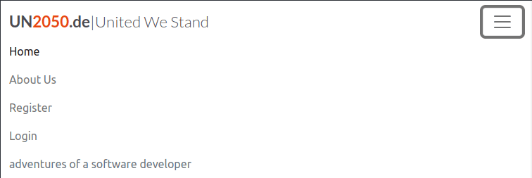

2. **User Registration and Authentication**: 
   Users can create accounts, log in, and log out securely. Once logged in, users can create and comment on posts.

 

3. **Post Creation and Voting**: 
   - Users can submit news stories on different topics.
   - Other users can upvote or downvote these posts based on their preferences.

   
 

    


 

4. **Commenting System**: 
   Users can comment on posts, fostering discussions on different news stories.
   
 


 


 

1. **Time and Date of Posting**: 
   Each post displays the date and time it was published to provide context to the news stories.
   
   

2. **User-friendly Interface**: 
   Un2050 provides a simple and intuitive interface for users to navigate posts, leave comments, and upvote/downvote stories. 

3. **Admin Moderation Tools**: 
   Admin users have access to moderation tools, allowing them to approve, delete, or edit user content when necessary.

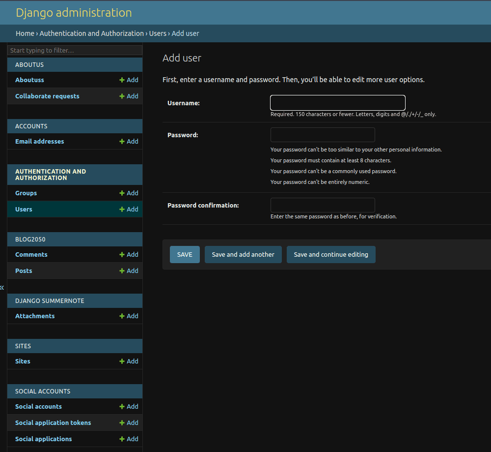 

8. **Pagination for Posts**: 
   Users can browse through a paginated list of posts, making it easier to explore older news stories.

   

 
9. **About us Page**
    
    

    


### Future Features:

1. **Private Messaging**: 
   Users will be able to send private messages to one another for more direct engagement.
   
2. **Multimedia Support**: 
   The ability for users to include images or videos in their posts to enhance the richness of shared content.
   
3. **Push Notifications**: 
   Users will receive notifications for upvotes, comments, and replies on their posts.
   
4. **Tagging System**: 
   Implement a tagging system for posts to enable better organization and searching across topics.

   
## Technologies Used  

- **HTML5:** Provides the foundational structure and semantic content for the **UN2050 News Site**, ensuring accessibility and compatibility across browsers.  
- **CSS3:** Styles and layouts are meticulously crafted to deliver a responsive and visually appealing design that enhances user experience.  
- **JavaScript (JS):** Powers the interactive elements of the site, such as navigation menus and user engagement features like comments and likes.  
- **[Python](https://www.python.org/):** The backend logic is implemented using Python, enabling robust data handling and seamless integration with the database.  
- **[Django](https://www.djangoproject.com/):** A high-level web framework used for building the server-side logic, managing models, views, templates, and user authentication efficiently.  
- **[Bootstrap](https://getbootstrap.com/):** Provides a responsive grid system and pre-designed components, accelerating the design process and ensuring consistency across the site.  
- **[PostgreSQL](https://www.postgresql.org/):** A powerful, open-source relational database system used to manage and store the site's data securely.  
- **[Cloudinary](https://cloudinary.com/):** Utilized for hosting and optimizing images, ensuring fast loading times and reduced server load.  
- **[Heroku](https://www.heroku.com/):** The platform used for deploying the live site, offering scalability and reliable hosting for the project.  
- **[Adobe XD](https://www.adobe.com/ie/products/xd.html):** Employed to design wireframes and prototypes, allowing the team to visualize and test user flows before development.  
- **[Adobe Illustrator](https://www.adobe.com/ie/products/illustrator.html):** Used to create the site's logo and social media graphics, maintaining a professional and consistent brand identity.  
- **[Adobe Photoshop](https://www.adobe.com/ie/products/photoshop.html):** Utilized to resize and optimize images for web use, enhancing the visual quality of the site while maintaining performance.  
- **[VS Code](https://code.visualstudio.com/):** The primary code editor for development, offering a range of extensions for better productivity and code management.  
- **Git Bash:** A command-line tool for version control and managing project repositories efficiently.  
- **GitHub:** Used to host and manage the codebase, ensuring version control and seamless collaboration among team members.  
- **[Google Fonts](https://fonts.google.com/):** Provides a selection of web fonts used to ensure a clean and modern typography throughout the site.  
- **[Favicon Generator](https://favicon.io/):** Used to create the site's favicon, adding a professional touch to the browser tab display.  


## Data Model:

This project uses Django’s Object-Relational Mapping (ORM) to handle data interactions between the application and PostgreSQL. The key models are as follows:

- **User**: Handles authentication and user profile information.
- **Post**: Represents a news article or story, including its title, content, author, category, and timestamp.
- **Comment**: Represents user comments on a post.
- **Category**: Represents a grouping or category of posts (e.g., Politics, Technology).
- **Vote**: Handles upvoting and downvoting of posts and comments.

The relational model ensures each post has associated comments, votes, and categories.


## Testing:

## Chrome Test

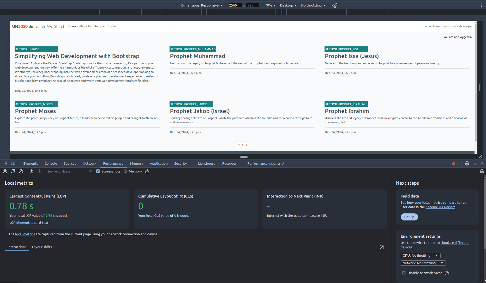


## Lighthouse Testing 

## Performance
The website was also put through Lighthouse testing via Chrome Devtools which tests a site under 4 different headings; Performance, Accessibility, Best Practices and it tests it under mobile and desktop criteria.

### Desktop lighthouse Performance
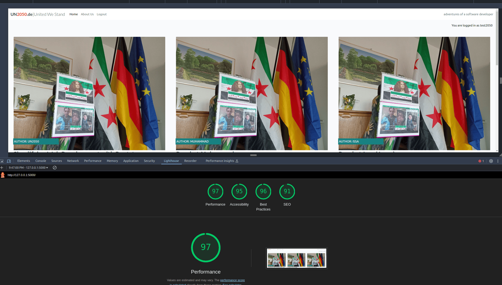
 

### Mobile lighthouse Performance

 
 
 


## Accessibility Testing 

#### Lighthouse Accessibility Testing 


 

#### WAVE Web Accessibility Evaluation Tool

[WAVE Web Accessibility Evaluation Tool](https://wave.webaim.org/) was used to check the colour contrast on the website for accessibility purposes which it passed. 


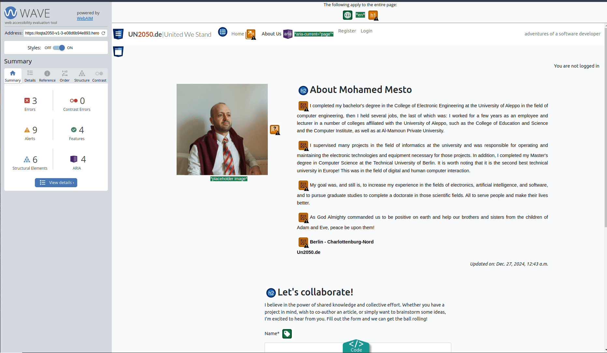


 


### Fixing Accessibility issues:

Accessibility issues have been resolved, ensuring the link is now descriptive and user-friendly for all users, including those relying on screen readers.


#### Adobe Color Accessibility Tool 

The [Adobe Color Accessibility Tool](https://color.adobe.com/create/color-accessibility) was used also to ensure the color palette met accessibility standards by testing contrast and simulating color blindness. This tool confirmed that the design maintains clarity and readability for users with visual impairments.
  


 


## Responsive Testing

#### The Responsive Design Checker

Responsiveness was tested via a few different mediums manually, including Chrome Devtools, [The Viewport Resizer](https://chrome.google.com/webstore/detail/viewport-resizer-%E2%80%93-respon/kapnjjcfcncngkadhpmijlkblpibdcgm?hl=en) chrome extension and [The Responsive Design Checker](https://responsivedesignchecker.com/) website.

#### The Viewport Resizer 


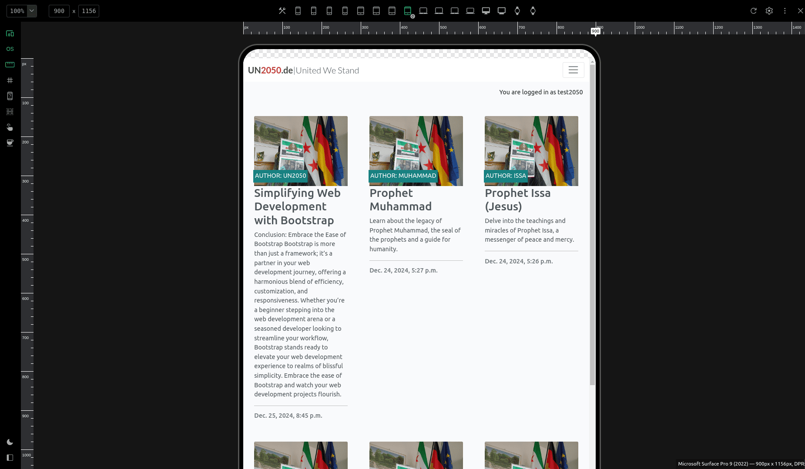


 


### Manual Testing:
We conducted manual testing by simulating common user behaviors to ensure the system works as expected. The scenarios tested include:

- **Creating posts and comments**: We verified that logged-in users can successfully create, edit, and delete posts and comments, ensuring that these actions were handled correctly by the system.
- **Upvoting and downvoting posts**: We tested the voting functionality to confirm that users could only vote once per post and that votes were correctly recorded and displayed.
- **Filtering posts by category**: We checked the category filter functionality to ensure users could easily browse posts based on specific categories.
- **Handling valid and invalid inputs**: We tested the system's ability to handle both valid and invalid inputs, ensuring appropriate error messages were displayed when users submitted empty forms, invalid post data, or attempted duplicate votes.

### Automated Unit Testing:
We also wrote and ran unit tests using Django’s `unittest` framework to verify the core functionalities of the website. Below is a summary of the unit tests we implemented:

1. **Post Creation and Retrieval:**
   - We wrote tests to verify that logged-in users can create new posts and that required fields are validated.
   - We ensured that posts were correctly displayed on both the homepage and individual post pages.
   - We tested the pagination feature to confirm that posts were properly divided into pages.

2. **Comment Submission:**
   - We confirmed that logged-in users could submit comments on posts and that these comments were correctly linked to the relevant posts and displayed in the right order.
   - We ensured non-logged-in users were restricted from submitting comments.

3. **User Authentication:**
   - We created unit tests to verify that users could successfully register, log in, and log out.
   - We tested that only authenticated users could create, edit, or delete posts and comments.
   - We ensured that password reset and account management features functioned as expected.

4. **Post Voting System:**
   - We wrote tests to confirm that the upvoting and downvoting functionality worked correctly, ensuring users could only vote once per post.
   - We ensured that vote counts were updated in real-time and accurately reflected user inputs.

5. **Category Filtering:**
   - We tested the category filtering functionality to confirm that posts were correctly filtered and displayed based on the category selected.
   - We ensured users could navigate between categories without any errors.

6. **Error Handling:**
   - We validated that the system properly handled invalid inputs, such as attempts to create posts or comments with missing data or invalid forms.
   - We checked that the system displayed helpful error messages when users performed invalid actions.

### Running Tests:
To run the unit tests we created, you can use the following command in the project directory:

```bash
python manage.py test
```

This command will execute all the tests we implemented, allowing you to confirm that each core functionality works as intended. Running these tests ensures that the site remains robust and stable throughout development.

 

  

 

## Validator Testing - Bugs Fixed:

## HTML Validation

Validation errors occur when HTML code does not adhere to the established standards, which can lead to browser inconsistencies or inaccessible content. It is crucial to test your code against validators like the [W3C HTML Validator](https://validator.w3.org/) to ensure compliance with best practices and maintain cross-browser functionality. Below are two examples of common validation errors, their causes, and fixes.

 

### **Example 1: Invalid Attribute in an Element**

#### **Error**: 
`Error: Attribute comment_id not allowed on element button at this point.`

#### **Cause**:  
HTML5 does not allow custom attributes directly on elements like `<button>`. Attributes that are not globally recognized or specific to the element type will result in validation errors.


#### **Fix**:  
Use `data-*` attributes to store custom data. These attributes are valid in HTML5 and can be accessed programmatically.

 


#### **Code Example**:  
**Before**:
```html
<button class="btn btn-delete" comment_id="13">Delete</button>
```

**After**:
```html
<button class="btn btn-delete" data-comment-id="13">Delete</button>
```

#### **JavaScript Access**:  
```javascript
const button = document.querySelector('.btn-delete');
console.log(button.dataset.commentId); // Outputs: "13"
```

---

### **Example 2: Invalid Width Attribute Value**

#### **Error**:  
`Error: Bad value 75% for attribute width on element img: Expected a digit but saw % instead.`


 

#### **Cause**:  
The `width` attribute in HTML expects a numeric value in pixels, not a percentage. Using a percentage value causes a validation error.

#### **Fix**:  
Use CSS for percentage-based widths, as this is the appropriate method for responsive designs.


#### **Code Example**:  
**Before**:
```html

```

**After**:
```html

```

---

### **Key Takeaways**:
- Validation errors often arise from using non-standard attributes or incorrect syntax.
- Use `data-*` attributes for custom data to comply with HTML5 standards.
- Shift layout and styling tasks to CSS for better maintainability and validation compliance.
- Regularly test your HTML with validators to ensure quality, accessibility, and browser compatibility. 

 
## CSS Validation

No CSS errors found.


## JS Validation


 

### Fixes Applied
1. **ESLint and JSHint Configuration:**
   - Added `/* eslint-env es6 */` and `/* jshint esversion: 6 */` to support ES6.
   - This explicitly tells linters that the script uses ES6 syntax.

2. **Replaced `for...of` with `Array.from().forEach`:**
   - `Array.from()` converts the `HTMLCollection` to an array, enabling the use of `forEach`.
   - Ensures compatibility with environments that may not support `for...of`.

3. **Changed `let` to `const` where variables are not reassigned:**
   - Ensures better readability and avoids unnecessary reassignments.

4. **Used `const` or `let` instead of `var`:**
   - To adhere to modern JavaScript standards.

5. **Ensured ES6 Compatibility for Template Literals and Arrow Functions:**
   - Verified ES6-compatible tools/environment usage.
   - Added notes to indicate the ES6 usage for future reference.

 


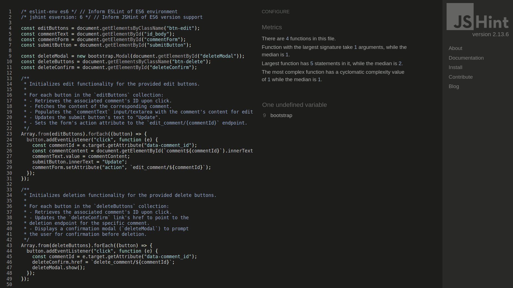


## Py Validation

No py errors remains.


## Getting Started:

To set up **Un2050** locally for development or testing purposes, follow these steps:

1. Clone this repository to your local machine.
2. Create a virtual environment and install the dependencies using:
   ```
   pip install -r requirements.txt
   ```
3. Set up the PostgreSQL database and configure environment variables in `.env` (use `.env.example` for reference).
4. Run migrations:
   ```
   python manage.py migrate
   ```
5. Create a superuser:
   ```
   python manage.py createsuperuser
   ```
6. Start the Django development server:
   ```
   python manage.py runserver
   ```
7. Access the site locally at [http://localhost:8000](http://localhost:8000).


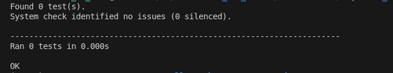


## Deployment:

This project can be deployed on platforms such as **Heroku** using the following steps:

1. Create a Heroku app and set the buildpacks to:
   1. `heroku/python`
   2. `heroku/nodejs` (if using front-end dependencies)
   
2. Set the required environment variables:
   - `DATABASE_URL`
   - `SECRET_KEY`
   - `DEBUG` (set to `False` in production)
   
3. Push your project to Heroku:
   ```
   git push heroku main
   ```


## Credits  

- **[Django Documentation](https://docs.djangoproject.com/):** For providing comprehensive guidance on the framework's features, concepts, and best practices.  
- **[Unsplash](https://unsplash.com/):** For the high-quality, free images used to enhance the visual appeal of the website.  
- **[Pexels](https://www.pexels.com/):** For additional media resources, providing free-to-use images and videos.  
- **[FontAwesome](https://fontawesome.com/):** For the icons used throughout the site to improve navigation and visual clarity.  
- **[Coolors](https://coolors.co/):** For creating a harmonious and accessible color palette for the site’s design.  
- **[W3Schools](https://www.w3schools.com/):** For quick references and examples of CSS and HTML techniques used in the project.  
- **[Bootstrap Documentation](https://getbootstrap.com/docs/):** For detailed explanations of components and utilities used to style and layout the site.  
- **[TinyPNG](https://tinypng.com/):** For compressing images, ensuring faster load times and better performance.  
- **[Google Fonts](https://fonts.google.com/):** For providing a modern and clean typography for the site's content.  
- **[Heroku Documentation](https://devcenter.heroku.com/):** For assistance with deploying the project and configuring server settings.  
- **[Cloudinary Documentation](https://cloudinary.com/documentation):** For image hosting and optimization, ensuring efficient and responsive performance.  
- **[Traversy Media](https://www.youtube.com/user/TechGuyWeb):** For video tutorials on Django, Bootstrap, and web development best practices.  
- **[Code Institute Course Material](https://codeinstitute.net/):** For foundational knowledge and guidance throughout the development of the project.
- **[Word_adventure](https://github.com/MohamedMesto/Word_adventure)**: From it the README template was sourced.

You can view the live site here also: [UN2050 News Site V1.3](https://loqta2050-v1-3-e08d6b94e893.herokuapp.com/).

