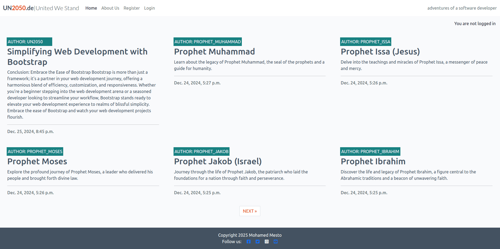
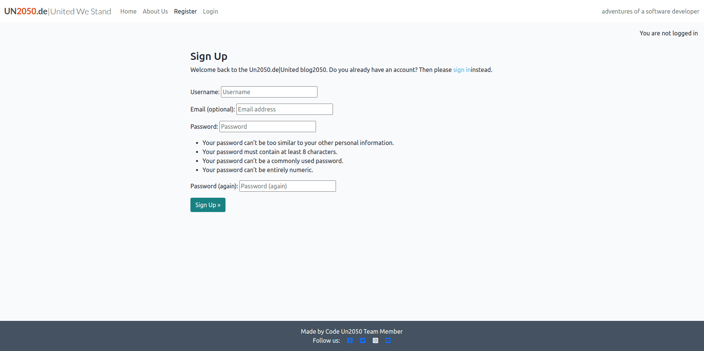
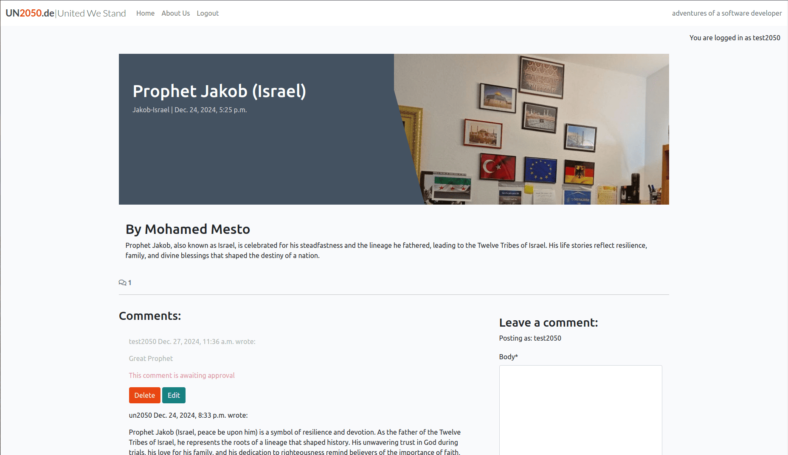
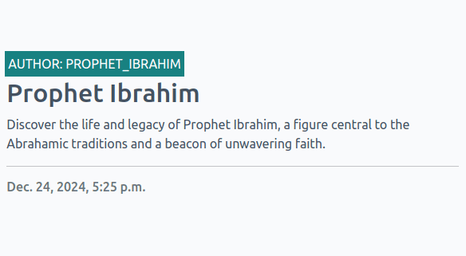
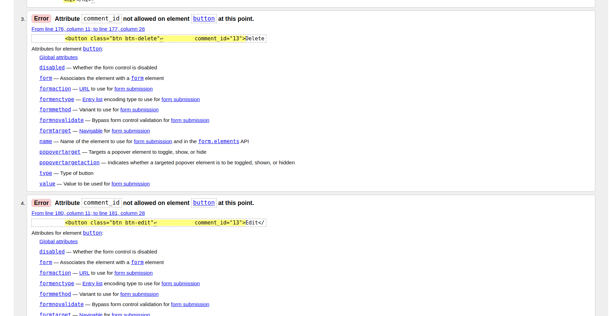
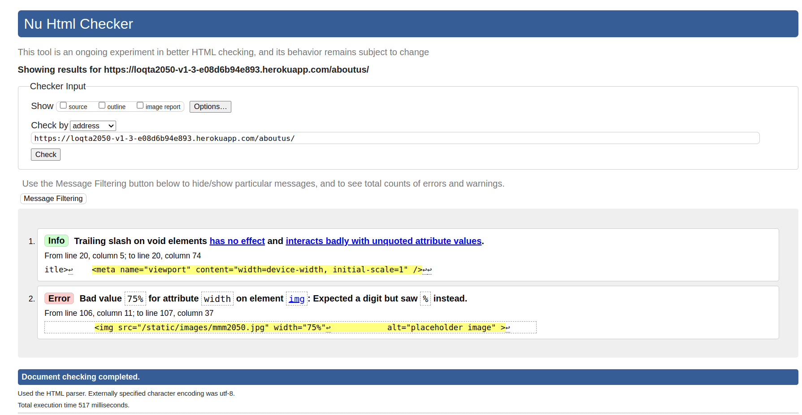
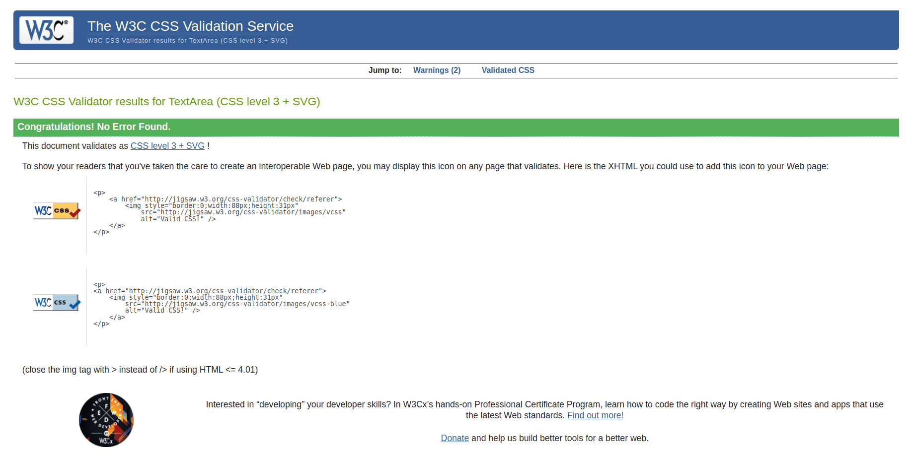

[](https://Un2050-v1-3-e08d6b94e893.herokuapp.com/)

 

---

---

# Un2050.de News Site V1.3

 ## Welcome 

Welcome to **Un2050**, a dynamic and interactive news platform built using Django. Un2050 is designed to provide users with the ability to post, read, and comment on news articles, offering a community-driven space for discussion and engagement. Whether you want to stay up-to-date with the latest news, engage in discussions, or share your opinions, **Un2050** provides a user-friendly platform for a seamless experience.

[Here is the live version of the project](https://loqta2050-v1-3-e08d6b94e893.herokuapp.com/)


## Purpose of the project

The goal of **Un2050** is to create a modern, Reddit-style news platform where users can share and discuss stories from around the world. By leveraging Django and PostgreSQL, this project aims to foster a community of contributors and readers, with features designed to enhance interaction, such as upvoting, commenting, and categorizing content by topics.

Whether you're a casual reader, an active participant, or a site admin, **Un2050** provides tools to create, manage, and engage with content in a meaningful way.


## User Stories:


## **User Stories**

### **As a Site User**:  

1. **View News Stories and Comments**  
   - *I want to view news stories and comments on different topics so I can stay informed and engaged.*  
   - **Acceptance Criteria**:  
     - AC1: A user can see a list of posts.  
     - AC2: A user can view all comments on a specific post by clicking on the comment thread.

2. **Register and Log In**  
   - *I want to register and log in to the platform so I can contribute by posting news stories and leaving comments.*  
   - **Acceptance Criteria**:  
     - AC1: A user can register an account using their email.  
     - AC2: A registered user can log in.  
     - AC3: Logged-in users can comment on posts.  

3. **Upvote or Downvote Posts**  
   - *I want to upvote or downvote posts so I can show my opinion on the content.*

4. **Filter Posts by Categories**  
   - *I want to filter posts by categories so I can quickly find stories that interest me.*

5. **View Time and Date of Posts**  
   - *I want to view the time and date of each post so I can know when the story was published.*

6. **View Comments on a Post**  
   - *I can view comments on an individual post so that I can read the conversation.*  
   - **Acceptance Criteria**:  
     - AC1: Admins can view one or more comments.  
     - AC2: Users can click on a comment thread to read the conversation.

7. **Leave Comments on a Post**  
   - *I can leave comments on a post so that I can be involved in the conversation.*  
   - **Acceptance Criteria**:  
     - AC1: Approved comments are visible.  
     - AC2: Users can reply to comments, forming conversation threads.  
     - AC3: Conversations are threaded when multiple comments exist.

8. **Modify or Delete My Comments**  
   - *I can modify or delete my comment on a post so that I can stay involved in the conversation.*  
   - **Acceptance Criteria**:  
     - AC1: Logged-in users can edit their comments.  
     - AC2: Logged-in users can delete their comments.

9. **View Full Post**  
   - *I can click on a post so that I can read the full text.*  
   - **Acceptance Criteria**:  
     - AC1: Clicking on a post title opens a detailed view of the post.

10. **Paginated List of Posts**  
    - *I can view a paginated list of posts so that I can select which post I want to view.*  
    - **Acceptance Criteria**:  
      - AC1: Multiple posts are listed when available in the database.  
      - AC2: The main page displays a paginated list of post titles.

11. **Read About the Site**  
    - *I can click on the About link so that I can read about the site.*  
    - **Acceptance Criteria**:  
      - AC1: Clicking the About link displays the site’s information.

---

### **As a Site Admin**:  

1. **Moderate User Posts and Comments**  
   - *I want to manage user posts and comments so I can moderate inappropriate content.*  
   - **Acceptance Criteria**:  
     - AC1: Admins can approve or disapprove comments.  
     - AC2: Approved comments are visible, while disapproved ones are not.

2. **Create, Read, Update, and Delete Posts**  
   - *I can create, read, update, and delete posts so that I can manage my blog content.*  
   - **Acceptance Criteria**:  
     - AC1: Logged-in admins can create, read, update, and delete blog posts.

3. **Create Draft Posts**  
   - *I can create draft posts so that I can finish writing the content later.*  
   - **Acceptance Criteria**:  
     - AC1: Logged-in admins can save draft blog posts.  
     - AC2: Draft posts can be edited and published later.

4. **Manage Categories**  
   - *I want to manage categories so I can keep the content organized.*

5. **View All User Activities**  
   - *I want to view all user activities and ensure compliance with community guidelines.*

6. **Update About Page Content**  
   - *I can create or update the about page content so that it is available on the site.*  
   - **Acceptance Criteria**:  
     - AC1: The About app is accessible in the admin panel.

---

### **As a Site Owner**:  

1. **Mark Collaboration Requests as Read**  
   - *I can mark collaboration requests as "read" so that I can see how many I still need to process.*  
   - **Acceptance Criteria**:  
     - AC1: Collaboration requests have a "read/unread" status flag in the database.  
     - AC2: Status can be toggled via the admin panel.  
     - AC3: Read requests are visually distinct from unread ones.

2. **Store Collaboration Requests in the Database**  
   - *I can store collaboration requests in the database so that I can review them.*  
   - **Acceptance Criteria**:  
     - AC1: Submitted requests are saved with details and metadata (e.g., date, status).  
     - AC2: Requests are retrievable through the admin interface.

3. **Add Contact Form for Collaboration Requests**  
   - *I can fill in a contact form so that I can submit a request for collaboration.*  
   - **Acceptance Criteria**:  
     - AC1: The website includes a contact form for collaboration requests.  
     - AC2: The form collects necessary details (name, email, message).  
     - AC3: Successful submissions display a confirmation message.


## Features:

### Existing Features:

The **Un2050 News Site** offers several features to enhance user experience:

1. **User Registration and Authentication**: 
   Users can create accounts, log in, and log out securely. Once logged in, users can create and comment on posts.

 

2. **Post Creation and Voting**: 
   - Users can submit news stories on different topics.
   - Other users can upvote or downvote these posts based on their preferences.

   
 

    


 

3. **Commenting System**: 
   Users can comment on posts, fostering discussions on different news stories.
   
   




1. **Time and Date of Posting**: 
   Each post displays the date and time it was published to provide context to the news stories.
   
   

2. **User-friendly Interface**: 
   Un2050 provides a simple and intuitive interface for users to navigate posts, leave comments, and upvote/downvote stories. 

3. **Admin Moderation Tools**: 
   Admin users have access to moderation tools, allowing them to approve, delete, or edit user content when necessary.

 

7. **Pagination for Posts**: 
   Users can browse through a paginated list of posts, making it easier to explore older news stories.

   

 
8. **About us Page**
    
    

    


### Future Features:

1. **Private Messaging**: 
   Users will be able to send private messages to one another for more direct engagement.
   
2. **Multimedia Support**: 
   The ability for users to include images or videos in their posts to enhance the richness of shared content.
   
3. **Push Notifications**: 
   Users will receive notifications for upvotes, comments, and replies on their posts.
   
4. **Tagging System**: 
   Implement a tagging system for posts to enable better organization and searching across topics.

## Data Model:

This project uses Django’s Object-Relational Mapping (ORM) to handle data interactions between the application and PostgreSQL. The key models are as follows:

- **User**: Handles authentication and user profile information.
- **Post**: Represents a news article or story, including its title, content, author, category, and timestamp.
- **Comment**: Represents user comments on a post.
- **Category**: Represents a grouping or category of posts (e.g., Politics, Technology).
- **Vote**: Handles upvoting and downvoting of posts and comments.

The relational model ensures each post has associated comments, votes, and categories.


## Testing:

### Manual Testing:
We conducted manual testing by simulating common user behaviors to ensure the system works as expected. The scenarios tested include:

- **Creating posts and comments**: We verified that logged-in users can successfully create, edit, and delete posts and comments, ensuring that these actions were handled correctly by the system.
- **Upvoting and downvoting posts**: We tested the voting functionality to confirm that users could only vote once per post and that votes were correctly recorded and displayed.
- **Filtering posts by category**: We checked the category filter functionality to ensure users could easily browse posts based on specific categories.
- **Handling valid and invalid inputs**: We tested the system's ability to handle both valid and invalid inputs, ensuring appropriate error messages were displayed when users submitted empty forms, invalid post data, or attempted duplicate votes.

### Automated Unit Testing:
We also wrote and ran unit tests using Django’s `unittest` framework to verify the core functionalities of the website. Below is a summary of the unit tests we implemented:

1. **Post Creation and Retrieval:**
   - We wrote tests to verify that logged-in users can create new posts and that required fields are validated.
   - We ensured that posts were correctly displayed on both the homepage and individual post pages.
   - We tested the pagination feature to confirm that posts were properly divided into pages.

2. **Comment Submission:**
   - We confirmed that logged-in users could submit comments on posts and that these comments were correctly linked to the relevant posts and displayed in the right order.
   - We ensured non-logged-in users were restricted from submitting comments.

3. **User Authentication:**
   - We created unit tests to verify that users could successfully register, log in, and log out.
   - We tested that only authenticated users could create, edit, or delete posts and comments.
   - We ensured that password reset and account management features functioned as expected.

4. **Post Voting System:**
   - We wrote tests to confirm that the upvoting and downvoting functionality worked correctly, ensuring users could only vote once per post.
   - We ensured that vote counts were updated in real-time and accurately reflected user inputs.

5. **Category Filtering:**
   - We tested the category filtering functionality to confirm that posts were correctly filtered and displayed based on the category selected.
   - We ensured users could navigate between categories without any errors.

6. **Error Handling:**
   - We validated that the system properly handled invalid inputs, such as attempts to create posts or comments with missing data or invalid forms.
   - We checked that the system displayed helpful error messages when users performed invalid actions.

### Running Tests:
To run the unit tests we created, you can use the following command in the project directory:

```bash
python manage.py test
```

This command will execute all the tests we implemented, allowing you to confirm that each core functionality works as intended. Running these tests ensures that the site remains robust and stable throughout development.
## Bugs:

 

### Remaining Bugs:
- Currently, no known bugs remain.

 

## Validator Testing:

## HTML Validation

Validation errors occur when HTML code does not adhere to the established standards, which can lead to browser inconsistencies or inaccessible content. It is crucial to test your code against validators like the [W3C HTML Validator](https://validator.w3.org/) to ensure compliance with best practices and maintain cross-browser functionality. Below are two examples of common validation errors, their causes, and fixes.

 

### **Example 1: Invalid Attribute in an Element**

#### **Error**: 
`Error: Attribute comment_id not allowed on element button at this point.`

#### **Cause**:  
HTML5 does not allow custom attributes directly on elements like `<button>`. Attributes that are not globally recognized or specific to the element type will result in validation errors.




#### **Fix**:  
Use `data-*` attributes to store custom data. These attributes are valid in HTML5 and can be accessed programmatically.

 


#### **Code Example**:  
**Before**:
```html
<button class="btn btn-delete" comment_id="13">Delete</button>
```

**After**:
```html
<button class="btn btn-delete" data-comment-id="13">Delete</button>
```

#### **JavaScript Access**:  
```javascript
const button = document.querySelector('.btn-delete');
console.log(button.dataset.commentId); // Outputs: "13"
```

---

### **Example 2: Invalid Width Attribute Value**

#### **Error**:  
`Error: Bad value 75% for attribute width on element img: Expected a digit but saw % instead.`



 

#### **Cause**:  
The `width` attribute in HTML expects a numeric value in pixels, not a percentage. Using a percentage value causes a validation error.

#### **Fix**:  
Use CSS for percentage-based widths, as this is the appropriate method for responsive designs.


#### **Code Example**:  
**Before**:
```html

```

**After**:
```html

```

---

### **Key Takeaways**:
- Validation errors often arise from using non-standard attributes or incorrect syntax.
- Use `data-*` attributes for custom data to comply with HTML5 standards.
- Shift layout and styling tasks to CSS for better maintainability and validation compliance.
- Regularly test your HTML with validators to ensure quality, accessibility, and browser compatibility. 

 
## CSS Validation

No CSS errors found.





## JS Validation


 

### Fixes Applied
1. **ESLint and JSHint Configuration:**
   - Added `/* eslint-env es6 */` and `/* jshint esversion: 6 */` to support ES6.
   - This explicitly tells linters that the script uses ES6 syntax.

2. **Replaced `for...of` with `Array.from().forEach`:**
   - `Array.from()` converts the `HTMLCollection` to an array, enabling the use of `forEach`.
   - Ensures compatibility with environments that may not support `for...of`.

3. **Changed `let` to `const` where variables are not reassigned:**
   - Ensures better readability and avoids unnecessary reassignments.

4. **Used `const` or `let` instead of `var`:**
   - To adhere to modern JavaScript standards.

5. **Ensured ES6 Compatibility for Template Literals and Arrow Functions:**
   - Verified ES6-compatible tools/environment usage.
   - Added notes to indicate the ES6 usage for future reference.

 


## Py Validation

No py errors found


## Getting Started:

To set up **Un2050** locally for development or testing purposes, follow these steps:

1. Clone this repository to your local machine.
2. Create a virtual environment and install the dependencies using:
   ```
   pip install -r requirements.txt
   ```
3. Set up the PostgreSQL database and configure environment variables in `.env` (use `.env.example` for reference).
4. Run migrations:
   ```
   python manage.py migrate
   ```
5. Create a superuser:
   ```
   python manage.py createsuperuser
   ```
6. Start the Django development server:
   ```
   python manage.py runserver
   ```
7. Access the site locally at [http://localhost:8000](http://localhost:8000).

## Deployment:

This project can be deployed on platforms such as **Heroku** using the following steps:

1. Create a Heroku app and set the buildpacks to:
   1. `heroku/python`
   2. `heroku/nodejs` (if using front-end dependencies)
   
2. Set the required environment variables:
   - `DATABASE_URL`
   - `SECRET_KEY`
   - `DEBUG` (set to `False` in production)
   
3. Push your project to Heroku:
   ```
   git push heroku main
   ```
## Credits:

- Django documentation for providing in-depth guidance on using the framework.
- [Unsplash](https://unsplash.com/) for free images used in the project.
- [Pexels](https://www.pexels.com/) for additional media resources.
- Icons from [FontAwesome](https://fontawesome.com/).
- Other Django, Python Websites

